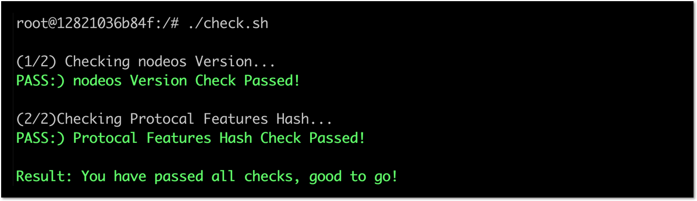
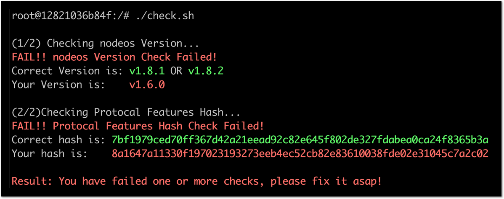

# EOSIO 1.8 Checker

This script is used for EOS Block Producers to check if their producing node is ready for 1.8.x upgrade.

# Usage


In order to use this script, make sure you have enabled producer api plugin on your producing node. Also, make sure `curl` is installed.

This script checks two things, nodeos version and protocal feature hash.

if your node is accessible via `localhost` on port `8888`, just run:

```
./check.sh
```

or you can specify `Host` and `Port` like this:

```
./check.sh xx.xx.xx.xx 8877
```

If all checks pass, the output would be like this:

  

otherwise:

  

